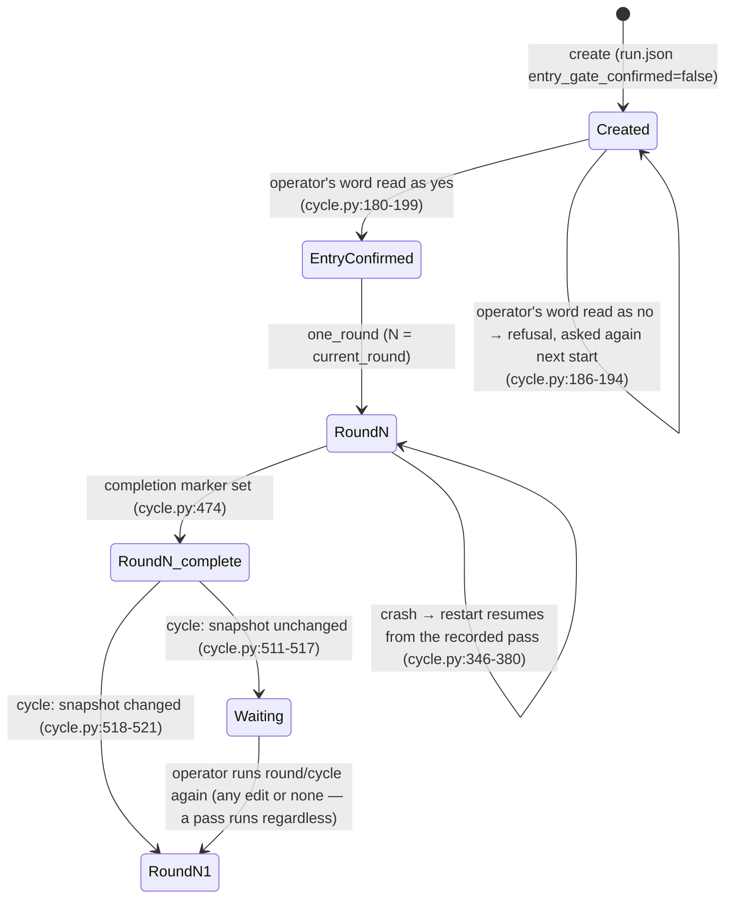

# Semantic map — `src/review_harness/` (the review harness)

- **Layer:** `src/review_harness/` (13 Python files), with `tests/harness/` as evidence of intended behaviour.
- **Repository / commit:** `semantics-toolchain` @ `960f86bce2c7331a0d93d47fec5631b5f2fcaf35`
- **Date:** 2026-09-07
- **Mode:** blind map, delivered as a file, English. **Maturity assumed:** released snapshot → full (production) scrutiny; §8c is therefore omitted.
- **Pointer convention.** Every statement rests on a file and line of the code or a test. Files of the layer are abbreviated to their bare name: `cycle.py:42` means `src/review_harness/cycle.py:42`. Test files are abbreviated likewise: `test_cycle.py:100` means `tests/harness/test_cycle.py:100`. Everything else is a path from the checkout root. Ranges `a-b` are inclusive.
- **Documents read as aids to meaning only** (never as the ground of a statement): `docs/review/critic.en.md`, `docs/review/development.en.md`, `docs/setup.md`, `docs/first_steps.md`, and the layer's specification `cycles/review-harness/2_harness_spec/artifact_spec.md` (Russian; referred to below as "the spec", by its section numbers §0–§9). Where the code decides something these texts do not say, or decides it differently, §8 flags it, marked *interpretation*.
- Russian quoted from the code or the spec is wrapped in guillemets «…».

---

## 0. Scope & coverage

| File | Lines | Coverage | Carries |
|---|---|---|---|
| `__init__.py` | 7 | full | the layer's self-description (a harness that "carries" the pair's process, `__init__.py:2-7`) |
| `cli.py` | 154 | full | the six commands and the console contract |
| `critic.py` | 126 | full | starting the critic, the pass, attestation |
| `cycle.py` | 521 | full | one round; the automatic cycle; the entry gate; the judged snapshot |
| `errors.py` | 69 | full | the refusal shape |
| `gates.py` | 188 | full | the operator channel; the parser of the operator's word |
| `launcher.py` | 134 | full | launcher generation and probe (no caller in the layer — §8 F4) |
| `liveness.py` | 60 | full | the two thresholds |
| `machine_profile.py` | 258 | full | the machine profile and its validation |
| `profile_sync.py` | 310 | full | exchange pairs, the outbox, the cache (no caller in the layer — §8 F4) |
| `readonly_guard.py` | 182 | full | the critic's read-only allow-list and header attestation |
| `runcat.py` | 817 | full | the run catalogue: creation, durable writes, recovery invariants |
| `subproc.py` | 544 | full | the watched role launch, process tree, liveness |
| `tests/harness/test_cycle.py` | 1196 | full | whole-round behaviour with real subprocess roles |
| `tests/harness/test_errors_and_runcat.py` | 397 | full | refusal shape; catalogue invariants |
| `tests/harness/test_gates_words.py` | 53 | full | the parser's accept/refuse boundary |
| `tests/harness/test_profiles_and_liveness.py` | 350 | full | profile validation, launcher, liveness, outbox, cache |
| `tests/harness/test_readonly_guard.py` | 242 | full | the allow-list and attestation |
| `.gitignore` | — | one line consulted | `.review_harness/` is ignored (`.gitignore:24`) |

Not opened (by instruction): anything else under `cycles/`, `evidence/`, `docs/prompts/audience/`, `src/assistant_memory/`, `docs/semantic_maps/`. The Russian working texts `docs/review/critic.md` / `development.md` were not read; their English translations were. No file was unreadable. Nothing in the layer was skimmed.

One consequence of the blind scope: the spec and the code both refer to things outside this layer — "R1.1" (a separate clean repository), the memory graph and its `get_operator_profile` tool, the prior "old contour" and incident `db5b243d`. The map records what the code *says* about them and never claims what they are.

---

## 1. Domain glossary & grain

**The pair.** Two texts — a critic's instruction and a development instruction — that the harness "carries" without changing; to the harness they are data (`__init__.py:2-7`). Only `docs/review/operator_profile.md` is actually read by the harness (`cycle.py:204`); the pair's own texts are never read by this layer — delivering them is the roles' business through the launch note.

**Roles.** Three, by the spec; two are processes for the harness:
- **The critic** — an external process started from a command template in the machine profile, with the model as an explicit argument (`critic.py:26-50`), fed the *content* of the accompanying note on stdin (`critic.py:76-78`). It must be a read-only `codex exec` unless break-glass is on (`readonly_guard.py:64-132`, `critic.py:66-68`).
- **Development** — a *headless* process started from a second command template with the run directory and round number substituted (`cycle.py:145-148`). It is started once per round, and a second time in the same round if it filed questions (`cycle.py:419`, `cycle.py:431`).
- **The operator** — a human reached only through the terminal the harness runs in (`gates.py:26-38`: `input`/`print` by default). The harness never answers for him: `Gate.ask` returns the verbatim answer and interpretation is development's business (`gates.py:40-59`).

**A run.** One directory — the *run catalogue* — created once with: the artifact paths, the critic model, the task description, the launch note (`runcat.py:192-254`). Its identity is the directory; a non-empty directory is refused for creation (`runcat.py:204-216`). It must be outside git or git-ignored (`runcat.py:242`, `runcat.py:32-90`).

**The artifact.** The judged subject: a list of paths recorded at creation (`runcat.py:245-253`), resolved against the repository root unless absolute (`cycle.py:242`). A directory artifact means every regular file under it except `__pycache__`, `.pyc` and anything under `.git` (`cycle.py:251-260`).

**The judged version (snapshot).** A per-artifact SHA-256 over (name length, name, body length, body) of every file (`cycle.py:263-274`) **plus** the hash of `task_description.md` and of `launch_critic.md` under the keys `__task_description__` and `__launch_note__` (`cycle.py:277-283`). The git head is *provenance*, deliberately outside the snapshot (`cycle.py:231-239`, `cycle.py:402-405`).

**A round.** Identified by an integer `n ≥ 1`, encoded in file names `round_NN_*` with at least two digits and no upper bound (`runcat.py:92-98`; `test_cycle.py:338-350`). A round's record is a triple: `round_NN_pass_meta.json` (written first), `round_NN_pass.md` (the pass, byte-for-byte), and `round_NN_outcomes.md` (development's outcomes) plus a `completed: true` marker inside the meta file (`runcat.py:305-348`, `runcat.py:440-455`). Per-round gate files `round_NN_gate_requests.json` / `round_NN_gate_answers.json` exist transiently (`cycle.py:75-80`).

**A pass.** The critic's whole transcript, glued **stderr first, then stdout** (`critic.py:106`), written verbatim without header or timestamp (`runcat.py:308-317`). "Empty" is measured on the substantive part after the codex answer marker, not on the transcript (`critic.py:111-125`, `readonly_guard.py:58-61`).

**Outcomes.** A non-empty file written by development (`cycle.py:456-486`). The harness never parses it; it only requires non-emptiness and rewrites it durably (`cycle.py:465-469`).

**Completion.** A round is complete only when the harness has set the `completed` marker after its own checks (`cycle.py:470-474`, `runcat.py:440-449`); development's outcomes file alone is *not* completion (`runcat.py:651-654`; `test_cycle.py:404-449`).

**A gate.** Any question to the operator: the entry gate, a fork filed by development, a confirmation, a clarification. Each is journalled verbatim in `gates.md` (`runcat.py:487-502`), but the journal is a *derivative*; the durable state of an answer lives in `run.json` (entry gate) or the answers JSON (forks) and is written *before* the journal (`gates.py:46-51`, `cycle.py:132-138`, `cycle.py:195-199`).

**The machine profile.** `<repo>/.review_harness/machine_profile.json` (`machine_profile.py:29-30`, `machine_profile.py:201-202`): the two command templates, the death-recognition window, the observed longest stall with its provenance note, the break-glass flag, an environment overlay, free notes (`machine_profile.py:34-61`). It is git-ignored in this checkout (`.gitignore:24`).

**The operator profile cache.** `<repo>/docs/review/operator_profile.md` (`cycle.py:204`). The harness reads two things from it: a `version:` line (`cycle.py:39`, `cycle.py:215-224`) and a `notify-within: <N>s` line (`liveness.py:26`, `liveness.py:29-46`). Both are mandatory; their absence is a loud refusal.

**Grain of identity — what makes two things the same:**
- Two *rounds* are the same iff their number is the same; the number is derived from the files present, never stored separately (`runcat.py:557-817`, `runcat.py:169-178`).
- Two *versions* of the artifact are the same iff their snapshot dicts are equal (`cycle.py:511`, `cycle.py:374`).
- Two *questions* are the same iff their `question` strings are equal — completeness of an answer batch is measured by identity of questions, not count (`runcat.py:732-751`, `cycle.py:124-127`).
- Two *exchange pairs* have no identity at all in the outbox — duplicates are admissible by design (at-least-once, `profile_sync.py:204-215`).
- Two *profile cache versions* are the same iff the `version:` values are string-equal, never by substring (`profile_sync.py:277-284`; `test_profiles_and_liveness.py:279-284`).

---

## 2. Input taxonomy

| Input | Meaning | What it triggers |
|---|---|---|
| `create <run_dir> --model --artifact… --description --launch-note` | a new run | catalogue creation; refuses an empty model, an empty description, a non-empty directory, a tracked directory (`cli.py:48-53`, `cli.py:77-87`, `runcat.py:204-244`) |
| `round <run_dir>` | run exactly one round | `one_round` (`cli.py:89-91`, `cycle.py:320-487`) |
| `cycle <run_dir>` | run rounds until the artifact stops changing | `run_cycle` (`cli.py:92-97`, `cycle.py:490-521`) |
| `status <run_dir>` | show the state from files | `restore()` only; no side effects (`cli.py:98-107`) |
| `profile-check` | is the machine profile runnable here | `load` + `check_executables` (`cli.py:108-111`) |
| `profile-init` | write a stub profile | refuses if one exists; the stub is already in the safe allow-list form (`cli.py:112-146`) |
| the operator's typed answer | his word | parsed by one parser (§5); journalled verbatim (`gates.py:56-58`) |
| `task_description.md` (in the run) | what the critic judges against | part of the judged snapshot: editing it forces a new pass (`cycle.py:277-283`; `test_cycle.py:973-998`) |
| `launch_critic.md` (in the run) | the critic's instruction, delivered as stdin content | part of the judged snapshot; a bare line `codex` inside it is refused before launch (`critic.py:79-93`) |
| `run.json` | run metadata: artifacts, model, entry-gate flag + verbatim answer + prompt | typed on every load; a string `"false"` is corruption (`runcat.py:512-555`) |
| `round_NN_gate_requests.json` (written by development) | a batch of forks for the operator: a list of `{question, kind?}` | served before development regains control; deleted after the whole batch (`cycle.py:83-139`) |
| `round_NN_gate_answers.json` (written by the harness, read by development) | `{question, answer}` records | rewritten durably after **every** answer (`cycle.py:131-135`) |
| `round_NN_outcomes.md` (written by development) | the round's outcomes | non-empty ⇒ durable rewrite + completion marker; empty/missing ⇒ refusal, pass intact (`cycle.py:456-486`) |
| the critic's stdout+stderr | the pass | streamed to a temp partial file, attested, then written to the catalogue (`critic.py:94-126`, `cycle.py:384-407`) |
| development's stdout+stderr | its journal | streamed to temp, then moved into the catalogue as `round_NN_dev.log` (`cycle.py:156-163`, `cycle.py:441-449`) |
| bytes on either pipe | a sign of life | resets the silence clock (`subproc.py:351-356`) |
| the machine profile file | launch knowledge | validated on load and on save (`machine_profile.py:205-232`, `machine_profile.py:235-237`) |
| the operator profile cache | delivery version + notification time | version recorded per round; `notify-within` announced (`cycle.py:336-337`) |
| git (`check-ignore`, `rev-parse`) | privacy of the catalogue; provenance | every durable write and every liveness tick (`runcat.py:118`, `subproc.py:431-436`); the round's `git_head` (`cycle.py:287-317`) |
| `ExchangePair` (API only) | one whole operator exchange | appended to the outbox; validated whole (`profile_sync.py:143-174`) |
| `GraphClient` (API only) | transport to the graph | `flush` / `refresh_cache` (`profile_sync.py:204-232`, `profile_sync.py:287-310`) |

Nothing in the layer reads the memory graph, the pair's texts, or any network resource. Everything the harness knows arrives by file, by pipe, by `git`, or by the operator typing.

---

## 3. State machines

### 3a. A run

There is **no terminal state**: nothing in the layer records finalisation, and the CLI has no finalise command (`cli.py:45-72`). `run_cycle` stops on "no edit" and prints that the decision is the operator's (`cli.py:94-97`, `cycle.py:512-517`). See §8 F1.

Note the `Waiting → RoundN1` edge: a manual `round` after the cycle stopped **always** runs a new critic pass — `one_round` never *decides* on a snapshot comparison (on resume it compares only to announce drift, `cycle.py:372-380`); only `run_cycle` decides (`cycle.py:381-407` vs `cycle.py:509-511`).

### 3b. One round (the states the files encode)

```mermaid
stateDiagram-v2
    [*] --> AwaitingPass: current_round = max(pass)+1 (runcat.py:169-178)
    AwaitingPass --> PassRecorded: meta written, then pass (runcat.py:343-347)
    PassRecorded --> Developing: dev process started (cycle.py:419)
    Developing --> ForksPending: dev wrote gate_requests.json
    ForksPending --> ForksAnswered: each answer durable at once (cycle.py:128-135); requests deleted (cycle.py:139)
    ForksAnswered --> Developing2: dev started a second time (cycle.py:431)
    Developing2 --> Refused: dev filed questions again (cycle.py:432-439)
    Developing --> OutcomesUnmarked: outcomes.md non-empty
    Developing2 --> OutcomesUnmarked
    OutcomesUnmarked --> Completed: harness marker (cycle.py:474)
    Developing --> Refused: outcomes empty or missing (cycle.py:475-486)
    PassRecorded --> PassRecorded: restart: resume_round, critic NOT replayed (runcat.py:159-166, cycle.py:346-354)
    OutcomesUnmarked --> Developing: restart: unmarked outcomes = still running (runcat.py:702)
```

Nuances the diagram cannot hold:

- **Resume point.** `resume_round` = the lowest round with a pass and no *completed* outcomes (`runcat.py:159-166`, with `rounds_with_outcomes` narrowed to completed rounds at `runcat.py:702`). On resume the critic is not started; analysis restarts from the recorded pass; a profile-version change and any artifact drift since the pass are announced and (the version) recorded (`cycle.py:346-380`; `test_cycle.py:137-170`, `test_cycle.py:313-335`).
- **Development runs again on resume.** A restart after outcomes-without-marker starts development over the same pass again and lets it overwrite the outcomes (`cycle.py:419`, `cycle.py:465-474`; `test_cycle.py:404-449`). The harness assumes the development command tolerates being run twice over one pass — see §9 R6.
- **A pass is a fact.** `write_pass` refuses to overwrite (`runcat.py:326-338`; `test_errors_and_runcat.py:107-116`), and no code path deletes a pass.
- **Privacy is a running condition, not a precondition.** The catalogue's ignored status is checked before the first stream (`cycle.py:332`), on every durable write (`runcat.py:118`), on every liveness tick of both roles (`cycle.py:391`, `cycle.py:161`, `subproc.py:431-436`), and again after development (`cycle.py:454`). A role that makes the catalogue tracked mid-run is killed within a tick (`test_cycle.py:939-970`).

### 3c. A watched role (critic or development)

Alive while bytes arrive on either pipe; dead when silence exceeds the machine window (`subproc.py:437-457`); refused on non-zero exit (`subproc.py:493-502`); refused when its process tree cannot be confirmed dead, on the success path too (`subproc.py:463-471`, `subproc.py:532-544`). On Windows the role is born suspended, put in a kill-on-close Job Object, then resumed; no Job Object ⇒ the role is killed and refused (fail-closed, `subproc.py:43-59`, `subproc.py:269-303`). On POSIX it is its own process group, killed with SIGKILL (`subproc.py:60-64`, `subproc.py:86-94`).

---

## 4. Boundary / segmentation / identity rules

**What starts a new round.** In `cycle` mode: after a completed round, the judged snapshot differs from the one recorded at the pass (`cycle.py:509-521`). The snapshot includes the description and the launch note, so *rewriting the instruction to the critic* is a new version too (`cycle.py:275-283`; `test_cycle.py:973-998`). In `round` mode: every invocation, unconditionally (`cycle.py:381-392`).

**What does NOT start a new round.** An unrelated commit (the git head is outside the snapshot, `cycle.py:236-239`); a `__pycache__`/`.pyc` appearing inside a directory artifact (`cycle.py:251-260`). Any other generated file inside a directory artifact *does* count as an edit (only those three exclusions exist).

**What continues a round.** A pass without completed outcomes (`runcat.py:159-166`); a hanging or partly answered batch of questions (`runcat.py:706-752`; `test_cycle.py:518-533`).

**What closes a round.** Only the harness's `completed` marker, set after: hanging questions served, a repeat filing refused, the outcomes made durable (`cycle.py:470-474`). "Closed" is irreversible in the sense that no code path unsets it; corruption of a closed round is a refusal, not a reopening (`runcat.py:660-672`).

**One batch of forks per round.** After the answers file exists, a second `gate_requests.json` from development is a refusal (`cycle.py:421-427`, `cycle.py:432-439`). But see §8 F2: on restart the second batch is served anyway.

**Questions are scoped to their round.** File names carry the round number (`cycle.py:75-80`); an answer of round 1 is never read as round 2's (`test_cycle.py:173-203`). A gate file for a round with no pass is corruption — "the measure is the pass, not the number" (`runcat.py:764-781`; `test_errors_and_runcat.py:205-231`).

**The artifact list is frozen at creation.** Every round's metadata must carry a snapshot whose key set equals *the current* `run.json` artifact list plus the two fixed keys (`runcat.py:365-383`). Editing `artifact_paths` in `run.json` mid-run therefore makes every earlier round's metadata "incomplete" and `restore()` refuses (`runcat.py:639-640`, `runcat.py:399-438`). Consequence: a run cannot grow or shrink its subject; a changed subject is a new run. Code-only — see §9 R2.

**The entry gate is passed once.** After confirmation, later rewrites of the description reach the critic with **no operator gate** — the description is judged, not confirmed, from round 2 on (`cycle.py:166-172`, `cycle.py:509-521`). Development is told by its own text to rewrite it after fixes; the harness neither checks authorship marks nor asks the operator. See §9 R1.

**What separates a pass from its header.** The first line equal to `codex` after the header block; everything before it (version line, header, prompt echo) is not the answer (`readonly_guard.py:31-61`). Hence a launch note containing a bare `codex` line is refused *by construction* — in the echo it would be mistaken for the marker (`critic.py:79-93`; `test_readonly_guard.py:214-242`).

**What separates a fork from a clarification.** A fork is any question development filed (`cycle.py:128-130`, kind defaulting to `a fork`); a clarification is the harness re-asking an unrecognised answer, journalled under the kind `a clarification of the record` against the text of the clarification, not the original question (`gates.py:76-83`; `test_cycle.py:812-837`).

**Where the middle of a role lives.** Streams go to `<system temp>/review_harness_streams/<sha256(run_dir)[:16]>/` (`cycle.py:42-60`) and enter the catalogue only by a durable write (`cycle.py:396-407`, `cycle.py:441-449`). On a timeout, an annulled pass, or a crash, the partial text stays *in temp* and the refusal points there (`subproc.py:449`, `readonly_guard.py:170-172`).

**Where an outbox pair may live.** Anywhere outside git, or an ignored path inside it — the same rule as the catalogue (`profile_sync.py:140`, `profile_sync.py:158`; `test_profiles_and_liveness.py:201-213`).

---

## 5. Classification & enum semantics

### 5a. The operator's word (`gates.py:142-188`) — one parser for every gate

Tokenisation: lower-case, commas and periods become spaces, split on whitespace (`gates.py:149`). No other punctuation is stripped.

| Class | Rule | Result |
|---|---|---|
| empty | no tokens | `None` — ask again (`gates.py:150-151`) |
| idiom of agreement with «не» | «не» immediately followed by «возражаю»/«против»/«возражаем» collapses to «да» **before** the negation scan (`gates.py:120`, `gates.py:155-164`) | consent token |
| negation | any token in `_NEGATIVE_FIRST` (`gates.py:115-116`: «нет», `no`, `n`, «не», «отмена», «отменяй», «стоп», `stop`, `not`, `never`, `nope`, `don't`, `dont`) **or** a token starting with «не» that contains an affirmative stem («несогласен») | `False` — negation dominates everything (`gates.py:169-175`) |
| consent | a token in `_AFFIRMATIVE_FIRST` (`gates.py:117`: «да», `yes`, `y`, «д», «ага», «давай», «конечно», «точно») or containing a stem from `_AFFIRMATIVE_STEMS` (`gates.py:118`: «принима», «принял», «подтвержда», «соглас», «финализир», «финализац») not prefixed by «не» | candidate (`gates.py:177-183`) |
| plain consent | every token is a consent token or an *empty word* (`gates.py:128-130`: «и», «же», «ну», «с», «со», «пожалуйста», `please`, `now`, «сейчас», «немедленно», «непременно», «точно», «конечно», «давай», «ага», «всё», «все», `all`, `go`, `ahead`) | `True` (`gates.py:184-185`) |
| consent with a tail | consent present, but some token is neither consent nor empty | `None` — a reservation the parser does not read; asked again (`gates.py:186-188`; `test_gates_words.py:39-48`) |
| no consent, no negation | e.g. «хм», `ok` | `None` (`test_gates_words.py:51-53`) |

Boundary facts a reader should know (all confirmed by running the parser on this checkout; the rules above are the ground):
- `ok`, `okay`, `sure`, `finalize` are **not** consent; `cancel` is **not** negation — all four are asked again.
- «да!» and «Да?» are asked again (the token «да!» matches nothing), while «финализируй!» is consent (the stem matches through the punctuation). The asymmetry follows from `gates.py:149` stripping only `,` and `.` and `gates.py:178-179` matching stems by substring.
- «Да, переноси» ("yes, carry it over") is asked again — a verb is a tail (`test_gates_words.py:44`).
- `yes stop` is a refusal; «да да» and `yes please` are consent.

Re-asking is unbounded: `ask_yes_no` loops until a verdict (`gates.py:91-96`); the re-ask text is one function for both askers (`gates.py:133-139`). `None` is documented as "I did not understand", never a decision (`gates.py:143`).

### 5b. Gate kinds (free strings, journalled as headings)
`the entry gate` (`cycle.py:184`), `a fork` (default for development's questions, `cycle.py:129`; development may pass its own `kind`), `a confirmation` (`gates.py:111`), `a clarification of the record` (`gates.py:83`, `gates.py:96`).

### 5c. `sandbox` attestation (`readonly_guard.py:155-182`)
| Header value | Meaning |
|---|---|
| absent | not attested — the pass is annulled ("silence does not count as read-only") |
| `read-only` (case-insensitive) | attested |
| anything else | annulled |
The header is searched only up to the second separator line (a line of ≥4 dashes, within the first 80 lines; fallback: the first 15 lines), so a quoted `sandbox: …` inside the answer cannot change attestation (`readonly_guard.py:47-57`; `test_readonly_guard.py:137-139`).

### 5d. The critic command allow-list (`readonly_guard.py:64-132`)
Accepted iff: executable basename is `codex`/`codex.exe` and the second token is `exec`; exactly one read-only sandbox pin (`-s read-only`, `--sandbox read-only`, `-s=read-only`, `--sandbox=read-only`, or `-c sandbox_mode=read-only`); exactly one `-m`/`--model` whose value is literally `{model}`; optionally `-C`/`--cd <dir>`; exactly one positional and it is `-`; no shell metacharacters anywhere; **any other flag ⇒ refused** (`readonly_guard.py:120-121`). The guard judges the *template*, not the substituted argv (`critic.py:29-34`, `critic.py:63-68`).

### 5e. `git check-ignore` return codes (`runcat.py:61-90`)
`0` = ignored (allowed); `1` = not ignored ⇒ "tracked" ⇒ refused; anything else = *the check did not run* ⇒ a different refusal naming git access, never passed off as "tracked" (`test_errors_and_runcat.py:317-337`). No repository above the path ⇒ nothing to check (`runcat.py:43-47`).

### 5f. A harness refusal (`errors.py:14-41`)
Three mandatory non-empty parts: what happened, `cause`, `next_action`; a refusal without them is a `ValueError` in the constructor itself (`errors.py:24-30`; `test_errors_and_runcat.py:38-42`). Rendered as three lines to stderr, exit code 1 (`cli.py:147-149`).

### 5g. Round-metadata fields (`runcat.py:350-397`)
`received_at`, `operator_profile_version` (non-empty string), `git_head` (non-empty string, not starting with `<`; the literal `outside-git` is legitimate, `cycle.py:296-297`), `artifact_snapshot` (dict keyed exactly by the artifacts + the two fixed keys), optional `completed` (must be a real boolean; `"false"` is corruption, `runcat.py:354-364`), optional `operator_profile_version_at_resume` (`cycle.py:361-364`).

### 5h. The machine profile's break-glass
`allow_unsafe_critic_sandbox: true` switches off both the structural guard and the attestation, and turns the whole transcript into the pass (`readonly_guard.py:137-138`, `critic.py:107-116`). It is announced at every launch as `[ATTENTION]` and "a production run must not look like this" (`cycle.py:338-344`). It must be a real boolean (`machine_profile.py:63-99`).

### 5i. `ExchangePair` completeness (`profile_sync.py:68-108`)
Whole = wording + signal, both non-empty; a reaction requires an unfolding; an unfolding requires a reaction (the caller writes «(no reaction came)» explicitly if none came). `signal_reading` may be `null` — ambiguity is stored as ambiguity (`profile_sync.py:62-65`).

---

## 6. Decision register

Provenance labels: **code-only** (no aid text states it), **both** (the spec or a role text states it and the code matches), **conflict** (see §8). Rationale is the code's own comment where one exists; otherwise "none stated".

| # | Decision | Alternatives | Provenance | Rationale (as stated in the code) |
|---|---|---|---|---|
| D1 | The critic model is a mandatory explicit input; no default. | inherit from tool config | both — `runcat.py:217-224`; spec §2 | a silent default would save the pass under an unknown model |
| D2 | An empty task description is refused at creation. | let the critic run | both — `runcat.py:225-233`; spec §6 | the critic would produce "a clean pass against an intent that does not exist" |
| D3 | The entry gate is asked once per run, before the first pass; refusal is a loud stop, re-asked on the next start. | ask every round; block silently | both — `cycle.py:166-199`; spec §6; `test_cycle.py:113-134` | the precedent of a first pass against a leaky description |
| D4 | The entry gate reads the operator's word with the same parser as every other gate. | exact string match | code-only — `cycle.py:177-185`; `test_cycle.py:382-401` | "one semantics for answers" |
| D5 | State before journal: the verbatim answer lands in `run.json` / the answers JSON in one write, and only then in `gates.md`; the journal is repaired from state on the next entry. | journal first | code-only — `cycle.py:195-199`, `cycle.py:132-138`, `runcat.py:256-277` | a crash window in which an answered question was asked again (rounds 8, 13, 14) |
| D6 | The pass is written the moment it is received, metadata *before* the pass, and never overwritten. | write after analysis | both — `runcat.py:305-348`; spec §3 | "a pass without metadata must not exist at any moment"; a round's pass is a fact |
| D7 | The pass is the whole transcript, stderr first. | stdout only | code-only — `critic.py:103-106`, `subproc.py:257-263` | codex prints its header to stderr; stdout-only attestation "would annul every honest pass" |
| D8 | Emptiness of a pass is judged on the text after the `codex` marker. | non-empty stdout | code-only — `critic.py:111-115`, `readonly_guard.py:39-44` | header + prompt echo without an answer is an empty pass |
| D9 | The critic must be a read-only `codex exec` built entirely from an allow-list; anything else is refused, unless break-glass. | deny-list of flags | both — `readonly_guard.py:64-132`; spec §2 ("the critic never writes") | a deny-list "loses to every codex update" |
| D10 | The guard stands at two points: profile write/load and launch; the launch guard judges the template. | launch only | code-only — `machine_profile.py:100-107`, `critic.py:63-68` | configuration must not silently reopen a closed decision; re-checking the substituted argv rejected our own command |
| D11 | A pass whose codex header does not say `sandbox: read-only` — or says nothing — is annulled before it reaches the catalogue. | trust the command | code-only — `readonly_guard.py:155-182`, `critic.py:107-110` | "silence does not count as read-only" (ported from another genre) |
| D12 | The model value must match `^[A-Za-z0-9._:-]+$`; the launch note must exist. | trust the caller | code-only — `critic.py:23`, `critic.py:35-46` | injection of flags through a marker's value |
| D13 | The launch note is delivered as stdin content via the positional `-`; a path in argv is legitimate only under break-glass. | path in argv | code-only — `critic.py:70-78`, `machine_profile.py:129-137`, `readonly_guard.py:125-127` | for codex a positional is instruction text, not a file |
| D14 | A bare line `codex` in the launch note is refused by construction. | parse harder | code-only — `critic.py:79-93` | in the prompt echo it is indistinguishable from the answer marker |
| D15 | The judged version = artifacts + description + launch note; git head is provenance only. | include head; artifacts only | code-only — `cycle.py:228-284` | an unrelated commit must neither trigger nor mask; a corrected instruction is a new input |
| D16 | Directory artifacts exclude `__pycache__`, `.pyc`, `.git`; hashing is length-prefixed. | plain concatenation | code-only — `cycle.py:251-273`; `test_cycle.py:722-735` | a rename plus an edit of the beginning skipped the mandatory pass (round 18) |
| D17 | `cycle` runs the next pass without the operator when the snapshot changed, and stops when it did not; it issues no verdict. | ask the operator each round; a round ceiling | both — `cycle.py:490-521`; spec §2, §9 | "the harness merely stops turning" |
| D18 | `round` always runs a new pass; only `cycle` decides on the snapshot comparison (`round` compares only to announce drift on resume). | compare in both | code-only — `cycle.py:381-392`, `cycle.py:372-380` | none stated |
| D19 | Resume from a recorded pass never replays the critic; drift and a profile-version change are announced, the version recorded. | replay | both — `cycle.py:346-380`; spec §3 (recoverability) | "a round's pass is a fact" |
| D20 | Development is a headless command run once per round, and again after forks are answered. | resume a live session | code-only *(interpretation of spec §2 "resumed or notified")* — `cycle.py:142-163`, `cycle.py:419-431` | "a hanging semantic decision blocks movement… the analysis is finished only now" |
| D21 | Forks are a per-round JSON batch; each answer is durable before the next question; questions are deleted only after the batch. | one file for all rounds; answers at the end | both (spec §6 says durable, per-question) — `cycle.py:83-139`; `test_cycle.py:556-596` | "two different answers from one operator to one question leave the cycle without an unambiguous state" |
| D22 | One batch of forks per round; a second filing is refused. | allow follow-ups | code-only — `cycle.py:421-439` | "a repeat filing is ambiguous" (round 9) — but see §8 F2 |
| D23 | Empty or missing outcomes = no analysis; the round is not complete; the pass stays. | accept | code-only — `cycle.py:475-486`, `runcat.py:462-467` | "an imitation of analysis" |
| D24 | Completion is the harness's marker set after its own checks, not the outcomes file. | outcomes file = done | code-only — `cycle.py:470-474`, `runcat.py:440-449` | a crash before the operator's question was served must not close the round (round 14) |
| D25 | Round numbers have no ceiling; two digits are a minimum of formatting. | `max_rounds` | both — `runcat.py:92-95`; spec §9; `test_cycle.py:338-350` | a ceiling "stops a healthy deep review and passes a sick one on round N−1" |
| D26 | The catalogue must be outside git or ignored; checked on every write and every tick; git-unavailable is a refusal. | check at creation only | both (spec §3) with a **changed rationale** — `runcat.py:32-90`; see §8 F5 | code: "hygiene… not defence"; spec: a leak threat |
| D27 | Durable = temp file + fsync + atomic replace + (POSIX) directory fsync. | `write_text` | code-only — `runcat.py:108-141` | a power cut can bring the old file back (round 9) |
| D28 | The middle of a role lives in system temp; only durable writes enter the catalogue. | stream into the catalogue | code-only — `cycle.py:42-60`; comment cites "the operator's decision in round 9" | "a crash leaves no half-written files in the catalogue" |
| D29 | Liveness = any bytes on either pipe; silence > window = death; the window belongs to the machine profile, the notification time to the operator profile; the sum is announced. | line-based; fixed numbers | both — `subproc.py:8-12`, `subproc.py:437-457`, `liveness.py:1-15`; spec §7 | "the sign of life is ANY bytes… CLIs draw progress with carriage returns" |
| D30 | The window must be > 0 and ≥ the observed stall, and the stall must carry a provenance note. | any positive | both — `machine_profile.py:138-163`; spec §7 | "a window with no grounding is the practically infinite threshold" |
| D31 | Both roles are watched by the same window and the same privacy tick. | watch the critic only | code-only — `cycle.py:149-152`, `cycle.py:156-163` | "the harness has no role whose death goes unrecognised" |
| D32 | A role is finished only with its whole process tree; unconfirmed death is a refusal even on success; Windows without a Job Object is fail-closed. | best effort | code-only — `subproc.py:36-64`, `subproc.py:463-471`, `subproc.py:532-544`; `test_cycle.py:1053-1095` | a DEVNULL helper is invisible to pipe watching |
| D33 | Non-zero exit of a role is a refusal; partial output is kept. | accept output regardless | code-only — `subproc.py:493-502` | none stated beyond "what is written in the run catalogue is intact" |
| D34 | Non-UTF-8 output is kept as visible escapes *and* as per-stream raw byte files; a failure to write the raw evidence is a refusal on the success path only. | replacement character | code-only — `subproc.py:324-349`, `subproc.py:505-526` | "verbatim covers broken bytes too" (rounds 9-11, 18-19) |
| D35 | The role's environment = the harness's environment overlaid by the profile's `env`; executables are looked up in *that* PATH. | inherit the shell | both — `subproc.py:281-284`, `machine_profile.py:186-190`; spec §4 ("command, environment, sandbox") | "the shell sees codex guarantees nothing" |
| D36 | Substitution markers `{model}` (critic) and `{run_dir}`,`{round}` (development) are mandatory in the templates. | substitute if present | code-only — `machine_profile.py:108-128` | "silently substituting a marker that is absent is itself a silent failure" |
| D37 | Every profile field is type-checked at runtime; a string `"false"` is refused. | trust annotations | code-only — `machine_profile.py:63-99`, `runcat.py:522-543`, `runcat.py:354-364` | truthy `"false"` would open a writing critic / skip the gate |
| D38 | The operator-profile cache must carry a `version:` line and a `notify-within: Ns` line; neither has a default. | a default | both (spec §5, §7) — `cycle.py:215-224`, `liveness.py:29-46` | "a lie about the delivery the round ran under"; "no numbers are baked into the code" |
| D39 | The cache is rewritten only when the content-addressed version differs, by string equality. | rewrite always; substring | code-only — `profile_sync.py:287-310`, `profile_sync.py:277-284` | «aaa» was counted as already written when the old one was «baaa» |
| D40 | Outbox pairs are whole or not written; a restored pair is validated exactly like an incoming one. | store halves | both — `profile_sync.py:68-108`, `profile_sync.py:187-192`; spec §5 | "the quality of a rendering cannot be recovered from halves" |
| D41 | `flush` removes each sent pair durably right after its own success; the first failure stops the send; at-least-once, not exactly-once. | remove at the end | code-only — `profile_sync.py:204-232` | exactly-once "would require idempotency on the graph's side and lies outside this slice"; comment says the duplicate window is "admissible by the operator's decision" (`profile_sync.py:258-262`) |
| D42 | Launchers: CRLF for Windows, an unescaped bracket in the body is refused statically, `sh -n` parses POSIX bodies, a probe branch runs at delivery. | dynamic probe only | both — `launcher.py:1-20`, `launcher.py:41-87`, `launcher.py:120-134`; spec §4 | cmd "silently tolerates a stray `)`" |
| D43 | A refusal without a cause and a next action is a `ValueError` in the constructor. | free-form messages | both — `errors.py:23-34`; spec §1 p.3, §8 | "a line like «The directory name is invalid» that suggests nothing" (paraphrased in `errors.py:5-8`) |
| D44 | The console is forced to UTF-8 with `backslashreplace`. | die on cp1252 | code-only — `cli.py:35-44` | the first live probe died on the first message |
| D45 | `profile-init` never overwrites an existing profile; its stub is already in the safe form. | overwrite | code-only — `cli.py:115-130` | "a stub laid over a live profile would erase the launch knowledge" |
| D46 | Foreign file names in the catalogue are ignored silently; only names matching the contract regexes count. | refuse junk | code-only — `runcat.py:571-592`; `test_errors_and_runcat.py:304-309` | "a foreign file… is not ours" |

---

## 7. Invariants

Each with where it is enforced. "Active path" = `one_round`/`run_cycle`; "restore" = `RunCatalog.restore()`, which runs at the start of every round and of `status`.

| Invariant | Enforced where |
|---|---|
| A refusal always names a cause and a next action. | constructor (`errors.py:23-34`); read helpers (`errors.py:44-69`) |
| The critic is started only after the operator confirmed the description. | active path only (`cycle.py:334`); **not** enforced by the catalogue API — `write_pass` accepts a pass with the flag false (tests do so: `test_errors_and_runcat.py:75-82`). Implicit at the API level. |
| A confirmed entry-gate flag carries the verbatim answer and the actual prompt. | write (`runcat.py:291-296`) and load (`runcat.py:532-541`) |
| A pass never exists without complete metadata; metadata is written first. | write (`runcat.py:342-347`); read (`runcat.py:399-438`); restore (`runcat.py:639-640`) |
| A pass is never overwritten, never empty. | write (`runcat.py:320-338`); restore (`runcat.py:641-650`) |
| Outcomes never exist without a pass, never empty. | `write_outcomes` (`runcat.py:462-474`); restore (`runcat.py:598-621`) |
| Passes form a contiguous history 1..N. | restore (`runcat.py:624-629`; `test_cycle.py:353-366`) |
| Outcomes and completed rounds each form a prefix of the history; completed ⇒ outcomes present; at most one round incomplete. | restore (`runcat.py:633-638`, `runcat.py:660-701`) |
| The `completed` marker is a real boolean. | read/write of round meta (`runcat.py:354-364`) |
| Gate files exist only for rounds with a pass; a completed round has no pending questions; answer files parse structurally even without their questions file. | restore (`runcat.py:757-808`) |
| The catalogue is outside git or ignored — on every durable write and every tick. | `runcat.py:118`, `subproc.py:431-436`, `cycle.py:332`, `cycle.py:454` |
| The critic's command is read-only by shape and by attestation (unless break-glass, which is announced). | `machine_profile.py:103-107`, `critic.py:66-68`, `critic.py:107-110`, `cycle.py:338-344` |
| A role's process tree is dead when the harness returns, on every path. | `subproc.py:463-471`, `subproc.py:532-544` |
| Thresholds are never baked in. | `liveness.py:37-45`; `machine_profile.py:138-163` |
| The round number is never a regulator. | asserted in `runcat.py:169-178` docstring; no ceiling exists anywhere in the layer |
| Nothing is deleted by the harness except: the partial stream (`cycle.py:407`), the temp dev log (`cycle.py:449`), a served requests file (`cycle.py:139`), sent outbox pairs (`profile_sync.py:230-231`). | by inspection of every `unlink`/`_rewrite` site |

Assumed but **not** enforced (worth knowing):
- That the development command is idempotent over a repeated run on one pass (§3b, §9 R6).
- That `task_description.md` rewrites between rounds carry authorship marks — the harness never reads the description's content, only hashes it (`cycle.py:277-283`).
- That the machine's temp directory is acceptable for a possibly private partial transcript (§9 R8).
- That codex's transcript format (separators of dashes, a `user` echo, a `codex` marker) stays as parsed (`readonly_guard.py:32-38`).

---

## 8. ⚠ Divergence flags (confirmed, evidence-backed, severity-ranked)

I examined the boundary logic, the recovery invariants, the guard, and the parser against the two role texts and the spec. I found **no correctness-breaking or metric-distorting divergence**: every ruling either matches what the documents claim or is a loud, recoverable refusal. The flags below are all **cosmetic by the scale** (no wrong result, no silent loss), included only because each changes what a reader of the spec or the role texts would expect of *this layer*. Every one is marked *interpretation* where it rests on reading the spec.

### F1 — [cosmetic · stale intent / code-only] The exit gate does not exist in the layer
**What the code does.** The CLI offers `create / round / cycle / status / profile-check / profile-init` and nothing else (`cli.py:45-72`). `run_cycle` stops on "no edit" and says the decision is the operator's (`cycle.py:512-517`, `cli.py:94-97`). `Gate.confirm_unconditional` — the one-"are-you-sure" mechanism — is defined (`gates.py:98-112`) and tested (`test_profiles_and_liveness.py:244-260`) but has **no caller** anywhere in `src/review_harness/` (grep of the layer). No file in the catalogue records finalisation; the run state machine has no terminal state (§3a).
**What the aids claim.** The spec (§6) names two gates, entry *and* exit: «Выход: финализация — только словом оператора», and (§6) that the machinery may ask "are you sure?" once and must then carry out the answer. The development text: finalisation is declared by the operator alone, from any state, nothing pending blocks it.
**Why it matters.** The operator's finalising word — the one act both texts make unconditional — has no carrier in the harness: nothing journals it, nothing marks the run closed, and a later `round` will happily start a new critic pass on a "finalised" run (`cycle.py:381-392`). *Interpretation*: the spec may intend finalisation to live outside this layer; the code does not say.
**Class:** `new_decision`. **Confidence:** confirmed. See §9 R3.

### F2 — [cosmetic · code-only, self-inconsistent] "One batch of forks per round" is refused live but served on restart
**What the code does.** After development regains control and files `gate_requests.json` a second time while `gate_answers.json` exists, the round is refused: "the contract is one batch of forks per round" (`cycle.py:421-427`, `cycle.py:432-439`). On the next `round`, however, the round resumes (`runcat.py:159-166`), `req_path.exists()` is true, and `_serve_gate_requests` asks exactly the *unanswered* questions (`cycle.py:412-417`, `cycle.py:124-127`), deletes the requests file, and starts development again. The second batch is thus served — at the price of one loud stop and a manual restart.
**What the aids claim.** Neither role text nor the spec limits forks to one batch; the development text says only that there are "a handful of such forks per round"; the spec (§6) says a hanging appeal stops movement until answered but is never lost.
**Why it matters.** Development that legitimately needs a follow-up fork (the operator's answer opened a new one) gets a refusal whose next action is "work out development's logic" (`cycle.py:426`) — while the actual recovery path already handles the case. The stated rule and the implemented behaviour disagree about whether a second batch is legitimate.
**Class:** `new_decision` (is a second batch legitimate?) — or `impl_error` if it is not. **Confidence:** confirmed by static trace. See §9 R5.

### F3 — [cosmetic · stale intent] The spec's `round_NN.md` is three files in the code
**What the code does.** A round is `round_NN_pass_meta.json` + `round_NN_pass.md` + `round_NN_outcomes.md` (+ `round_NN_dev.log`, `round_NN_gate_*.json`) (`runcat.py:95-98`, `runcat.py:326`, `runcat.py:344`, `runcat.py:475`, `cycle.py:446`).
**What the spec claims.** §3: the round record is «`round_NN.md`: проход критика дословно + исходы разработки» — one file holding the pass and the outcomes together.
**Why it matters.** A human who opens the catalogue by hand looking for `round_NN.md` — the spec calls the file names "known to the code and to a human" (`runcat.py:100-101`) — finds none. The split is what makes "metadata before pass" and "never overwrite the pass" possible (D6), so the code is the better design; the spec is stale. *Interpretation.*
**Class:** `spec_error`. **Confidence:** confirmed.

### F4 — [cosmetic · code-only] Two spec'd mechanisms are library code the cycle never calls
**What the code does.** `launcher.write_launcher` / `launcher.probe` (spec §4: the launcher is delivered executable, executability checked at delivery) and `profile_sync.PairBuffer` / `refresh_cache` (spec §5: raw material buffered when the graph is down; the cache refreshed from the canon) exist, are validated by tests (`test_profiles_and_liveness.py:83-132`, `test_profiles_and_liveness.py:150-197`, `test_profiles_and_liveness.py:263-350`), and are imported by **nothing** in `src/review_harness/` (grep of the layer: only their definitions). Likewise `RunCatalog.write_outcomes` (`runcat.py:460-477`) and `RunState.pending_gate_rounds` (`runcat.py:156`) are produced but unused on the active path — `one_round` rewrites outcomes itself (`cycle.py:469`) and tests `req_path.exists()` directly (`cycle.py:412`).
**What the aids claim.** The spec (§4, §5) describes both as duties *of the harness* («обвязка отвечает за сырьё и пересборку»); the development text assigns the cache refresh to development ("if the graph is available, refresh the cache at the start of the cycle").
**Why it matters.** In this layer, as shipped: no launcher is generated or probed during a run (the profile's `dev_argv`/`critic_argv` are started directly, `subproc.py:274-285`); no exchange pair is ever recorded; the cache is only *read*, never refreshed (`cycle.py:202-225`). Whoever expects the harness to collect raw material or refresh the cache is expecting something that has no caller. The layer's own memory of the "layer nobody calls looks working" precedent is in `test_cycle.py:4-7`. *Interpretation* as to whose duty it is.
**Class:** `new_decision`. **Confidence:** confirmed.

### F5 — [cosmetic · doc-vs-code on the rationale of a privacy rule] Why the catalogue must be outside git
**What the code does.** The same behaviour as the spec asks for — a tracked catalogue is refused (`runcat.py:79-90`) — but the code states its *meaning* as: «the git ignore on the catalogue is HYGIENE for the repository tree… not defence; the publication threat is closed a level higher — the working repository is not published at all (R1.1, a separate clean repository)» (`runcat.py:35-41`, again `runcat.py:479-484`, `profile_sync.py:120-126`), citing "the pivot of round 9".
**What the spec claims.** §3: the catalogue is outside git *because* the critic reads the whole repository and the graph, and «процитированный приватный фрагмент не должен попасть в историю публичной репы (утечка через публикуемые артефакты — в модели угроз оператора)» — the rule is a leak defence.
**Why it matters.** Behaviour is identical, so this is not a wrong result — but the two texts name *different things* as what stands between a quoted private fragment and a public tree: the spec says this check; the code says something outside this layer ("R1.1") that the map cannot see. If R1.1 is not in force, the code's stated reason for relaxing the meaning of the check is gone. Hard-floor topic (privacy), so it is flagged even though the mechanism matches. *Interpretation.*
**Class:** `spec_error` (stale) or `new_decision`. **Confidence:** confirmed (of the divergence in stated rationale). See §9 R7.

### F6 — [cosmetic · code-only reading of a role rule] "Are you sure?" once vs. unbounded clarification
**What the code does.** An unrecognised answer is re-asked without limit (`gates.py:91-96`, `gates.py:73-83`); consent with any tail («Да, переноси», "yes, but only after I review") is *unrecognised* and re-asked (`gates.py:186-188`; `test_gates_words.py:39-48`). The code's own reading: a clarification "is not a second 'are you sure?'" (`gates.py:104-107`).
**What the aids claim.** Development text: "You may ask 'are you sure?' once; you may not refuse." Spec §6: the machinery «вправе один раз спросить» "are you sure?" «и обязана исполнить ответ».
**Why it matters.** The rule the texts state counts questions; the code counts only the *kind* of question. An operator whose natural consent carries a verb or a condition is asked again, possibly repeatedly, and the code decides this is not a refusal because "the action was neither performed nor cancelled" (`gates.py:136-138`). Whether repeated re-asking is within "once" is a reading only the operator can settle. *Interpretation.*
**Class:** `new_decision`. **Confidence:** confirmed. See §9 R4.

Examined and found **consistent** with the aids (no flag): the entry gate before the first pass; the pass written immediately and never overwritten; recovery from files alone; the critic read-only by shape and attestation; no round ceiling; thresholds from profiles, sequential not competing; every refusal with cause and next action; the model as explicit input; whole exchange pairs only; the cycle turning on edits alone and issuing no verdict.

---

## 8b. Hypotheses / worth checking (unverified — kept separate)

- **H1 — a transient git failure kills a healthy critic run.** The privacy tick runs `git check-ignore` every second during both roles (`subproc.py:423`, `subproc.py:431-436`, `cycle.py:391`); any return code other than 0/1, or git hanging past 30 s, raises inside the loop (`runcat.py:49-78`) and the role is killed (`subproc.py:532-534`). A momentary `index.lock`, a dubious-ownership flip, or an antivirus stall would then cost a whole critic pass (no pass file is written before the transcript completes, `cycle.py:385-396`). Whether such transients happen on the target machines needs a data run. Not a wrong result — a cost.
- **H2 — generated litter other than `__pycache__` forces needless passes.** Only three exclusions exist in the snapshot (`cycle.py:251-260`). A directory artifact that accumulates `.pytest_cache`, editor swap files, or build output between rounds would look edited and trigger another full pass in `cycle` mode (`cycle.py:518-521`). Whether real artifacts are directories with such litter is environment-dependent.
- **H3 — a development role that always rewrites the description never lets the cycle stop.** The development text instructs rewriting the description after fixes; the snapshot hashes it (`cycle.py:277-283`); `cycle` has no round ceiling and no operator gate between automatic rounds unless development files forks (`cycle.py:506-521`). If a development role rewrites the description cosmetically (a date, a round counter) even on a clean pass, the cycle turns forever. Observation, not proof: it depends on the development command, which is outside this layer.
- **H4 — the codex transcript format is a moving target.** Attestation depends on ≥2 separator lines within the first 80 lines and a `sandbox:` line before the second one (`readonly_guard.py:47-57`); a codex release that changes its header would annul every pass ("did not attest", `readonly_guard.py:162-173`) — loudly, so not silent, but a full outage of the layer. The parse is pinned to a probe log the map cannot see (`readonly_guard.py:32-35`).

---

## 8c. MVP shortcuts
Omitted — the scope is a released snapshot and was scrutinised as production.

---

## 9. Rulings requiring intent confirmation

1. **R1 — Description drift after round 1 reaches the critic with no operator gate.** The entry gate is passed once (`cycle.py:166-172`); later rewrites of `task_description.md` — which the development text tells development to make — are hashed into the snapshot and start a new pass with no human in the loop (`cycle.py:277-283`, `cycle.py:518-521`; `test_cycle.py:973-998`). Encoded: `cycle.py:166-199`, `cycle.py:490-521`. → Confirm: is "confirm once, then trust authorship marks the harness never reads" the intended gate, or should a changed description re-open the entry gate?
2. **R2 — The artifact list of a run is frozen at creation.** Round metadata must cover exactly the *current* `run.json` artifacts (`runcat.py:365-383`); editing the list mid-run makes the whole history "incomplete" and `restore()` refuses (`runcat.py:639-640`). Encoded: `runcat.py:350-397`. → Confirm: a changed subject = a new run, never a grown one?
3. **R3 — Finalisation lives outside the harness.** No command, no marker, no journal entry for the operator's finalising word; a later `round` on a "finished" run starts a new pass (§8 F1). Encoded: `cli.py:45-72`, `cycle.py:512-517`. → Confirm: is the harness meant to stay silent about finalisation, or should the exit gate the spec names be carried here?
4. **R4 — Consent with a tail is not consent.** «Да, переноси», "yes, go ahead after I look" are re-asked; only consent words plus a closed list of empty words pass (`gates.py:184-188`, `gates.py:128-130`); `ok`/`sure` are not consent; `cancel` is not refusal; negation anywhere wins (`gates.py:169-175`). Re-asking is unbounded (`gates.py:91-96`). Encoded: `gates.py:115-188`; `test_gates_words.py:16-53`. → Confirm the accept boundary, the vocabulary, and that unbounded clarification counts as "asking once".
5. **R5 — One batch of forks per round.** A second `gate_requests.json` in one round is refused live but served on restart (§8 F2). Encoded: `cycle.py:412-439`. → Confirm: is a follow-up fork legitimate (then the live refusal is wrong) or not (then the restart should refuse too)?
6. **R6 — Development may be run twice over one pass.** After forks are answered, and after any crash before the completion marker, the development command is started again on the same round and overwrites its outcomes (`cycle.py:431`, `cycle.py:465-474`; `test_cycle.py:404-449`). Encoded: `cycle.py:409-439`. → Confirm: the development command is required to be idempotent over a repeated run (re-applying fixes, re-filing nothing)?
7. **R7 — What stands between a quoted private fragment and a public tree.** The code says the git-ignore check is hygiene and the leak is closed by "R1.1" outside this layer (`runcat.py:35-41`); the spec says this check is the defence (§8 F5). → Confirm which is current, and whether R1.1 is in force.
8. **R8 — Partial transcripts live in the system temp, unguarded.** The critic's partial (and an annulled or timed-out pass) sits in `<temp>/review_harness_streams/…` with no privacy check and no cleanup on refusal (`cycle.py:42-60`, `cycle.py:407` reached only on success; `readonly_guard.py:170-172`). → Confirm: is the OS temp inside or outside the threat model for quoted private text?
9. **R9 — Break-glass is the single door, and it opens everything.** `allow_unsafe_critic_sandbox: true` disables the shape guard *and* the attestation and makes the whole transcript the pass (`readonly_guard.py:137-138`, `critic.py:107-116`), announced per launch (`cycle.py:338-344`). Encoded: `machine_profile.py:51-55`. → Confirm this is acceptable for non-codex critics (the tests use it for Python roles, `test_cycle.py:54-61`), and that "announced loudly" is enough.
10. **R10 — The judged version includes the launch note.** Editing `launch_critic.md` — the instruction to the critic — is a new version and forces a new pass (`cycle.py:275-283`). → Confirm: an instruction edit is a review event, not housekeeping?
11. **R11 — At-least-once for exchange pairs.** A crash between a successful send and the outbox rewrite re-sends one pair; the code records this as "admissible by the operator's decision on the depth of protection" (`profile_sync.py:258-262`, `profile_sync.py:204-215`). → Confirm that a duplicate pair in the profile's raw material is acceptable (the code says duplicates "distort the profile's raw material", `profile_sync.py:210-211`).
12. **R12 — `round` never acts on a snapshot comparison; `cycle` always does.** A manual `round` on an unchanged artifact spends a full critic pass (`cycle.py:381-392`). → Confirm this is the intended meaning of "run one round".

*(An operator "no" on any line typically means code AND doc are both wrong — the highest-value outcome.)*
